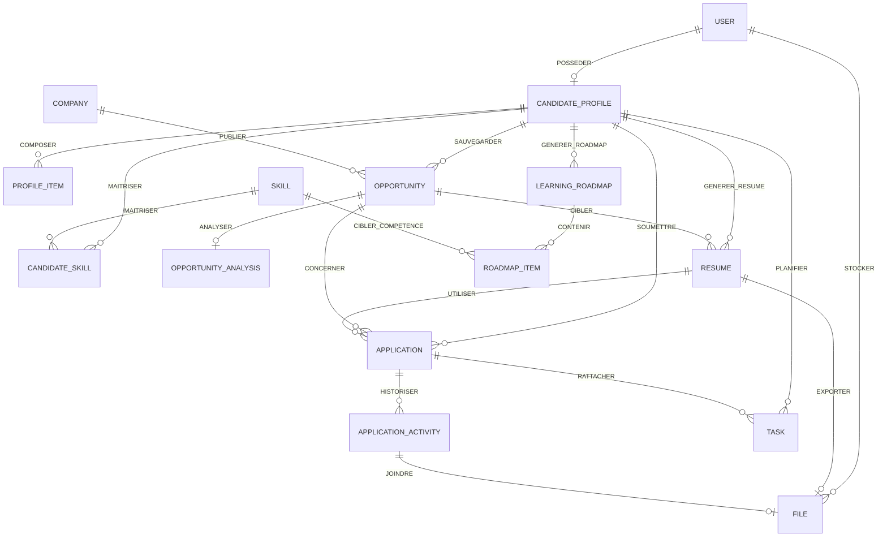

# CareerPilot AI — MCD (Modèle Conceptuel de Données)

## Objectif

Ce document est le **Modèle Conceptuel de Données** officiel pour la version MVP de CareerPilot AI.

Il définit les entités métier, leurs attributs conceptuels, les associations, les cardinalités et les règles de gestion. Les types SQL, les colonnes FK et les index sont définis dans `MLD.md`.

## Conventions

- Noms d'entités en français, au singulier, en majuscules.
- `#` précède l'identifiant conceptuel.
- Les cardinalités : `1,1` (exactement un), `0,1` (zéro ou un), `1,N` (un ou plusieurs), `0,N` (zéro ou plusieurs).
- Les verbes d'association sont à l'infinitif.
- Aucun type SQL, ni PK/FK, ni index dans ce document.

## Carte conceptuelle

---

## 1. Entités et attributs conceptuels

### USER
- **#user_id**
- full_name
- email
- password_hash
- email_verified_at
- role
- account_status
- timezone

**Règles :** L'email est unique. Le mot de passe n'est jamais stocké en clair.

---

### CANDIDATE_PROFILE
- **#profile_id**
- headline
- professional_summary
- phone
- city
- country
- linkedin_url
- github_url
- portfolio_url
- availability_status
- target_roles
- preferred_locations
- work_mode
- contract_types
- salary_min
- salary_max
- languages
- profile_completion

---

### PROFILE_ITEM
- **#item_id**
- type
- title
- organization
- location
- start_date
- end_date
- description
- metadata

**Règles :** Le type peut être `education`, `experience`, `project` ou `certification`.

---

### SKILL
- **#skill_id**
- name
- normalized_name
- category
- is_active

**Règles :** Le nom normalisé est globalement unique.

---

### FILE
- **#file_id**
- original_name
- stored_name
- path
- mime_type
- size
- checksum
- purpose
- processing_status
- extracted_data

**Règles :** `purpose` identifie l'usage métier (ex. `cv_import`, `resume_generated`). Les données extraites sont temporaires ; seules les données validées par le candidat entrent dans le profil de confiance.

---

### COMPANY
- **#company_id**
- name
- website
- industry
- location
- size_band
- research
- researched_at

**Règles :** Les entreprises sont propres à chaque candidat dans le MVP. Une entreprise peut être partagée entre plusieurs offres.

---

### OPPORTUNITY
- **#opportunity_id**
- title
- source_type
- source_url
- description
- location
- work_mode
- contract_type
- seniority_level
- salary_min
- salary_max
- status

**Règles :** La description est l'état courant ; il n'existe pas de versionnage d'offre dans le MVP.

---

### OPPORTUNITY_ANALYSIS
- **#analysis_id**
- status
- summary
- match_score
- confidence
- requirements
- findings
- clarification
- profile_snapshot
- job_snapshot
- scoring_version

**Règles :** Une nouvelle analyse remplace transactionnellement l'analyse courante. Les instantanés (snapshots) préservent la cohérence historique.

---

### RESUME
- **#resume_id**
- title
- template_key
- content
- status
- generated_by
- approved_at

**Règles :** Un CV peut être générique (sans cible) ou ciblé vers une opportunité (au plus un CV ciblé par opportunité). Les versions approuvées sont immuables.

---

### APPLICATION
- **#application_id**
- current_status
- applied_at
- contact_name
- contact_email
- contact_phone
- next_action_at

**Règles :** Un candidat ne peut soumettre qu'une seule candidature par opportunité.

---

### APPLICATION_ACTIVITY
- **#activity_id**
- type
- old_status
- new_status
- content
- occurred_at

**Règles :** Les activités forment un historique chronologique immuable.

---

### TASK
- **#task_id**
- type
- title
- description
- status
- priority
- scheduled_at
- due_at
- remind_at
- reminder_sent_at
- metadata

**Règles :** Le type peut être `task`, `reminder`, `interview` ou `follow_up`. Une tâche appartient toujours à un candidat et peut optionnellement être liée à une candidature.

---

### LEARNING_ROADMAP
- **#roadmap_id**
- title
- status
- generated_at

**Règles :** Un candidat a au plus un roadmap actif.

---

### ROADMAP_ITEM
- **#roadmap_item_id**
- title
- description
- priority
- status
- progress_percent
- target_date

**Règles :** Un item peut référencer au plus une compétence. Compléter un item ne vérifie pas automatiquement la compétence.

---

## 2. Associations et cardinalités

### POSSEDER
- USER `(0,1)` possède CANDIDATE_PROFILE `(1,1)`
- **Attribut d'association :** date_creation

**Règle :** Un utilisateur a au plus un profil candidat. Un profil appartient toujours à un utilisateur.

---

### STOCKER
- USER `(0,N)` stocke FILE `(1,1)`
- **Attribut d'association :** date_ajout

---

### COMPOSER
- CANDIDATE_PROFILE `(0,N)` compose PROFILE_ITEM `(1,1)`
- **Attribut d'association :** ordre_affichage

---

### MAITRISER
- CANDIDATE_PROFILE `(0,N)` maîtrise SKILL `(0,N)`
- **Attributs d'association :**
  - niveau_competence
  - annees_experience
  - derniere_utilisation
  - preuves

**Règle :** Cette association devient la table `candidate_skills` dans le MLD. Un profil ne peut pas contenir deux fois la même compétence.

---

### SAUVEGARDER
- CANDIDATE_PROFILE `(0,N)` sauvegarde OPPORTUNITY `(1,1)`
- **Attribut d'association :** date_sauvegarde

---

### PUBLIER
- COMPANY `(0,N)` publie OPPORTUNITY `(0,1)`

**Règle :** Une offre peut être publiée par une entreprise ou être sans entreprise identifiée.

---

### ANALYSER
- OPPORTUNITY `(0,1)` analyse OPPORTUNITY_ANALYSIS `(1,1)`
- **Attribut d'association :** date_analyse

**Règle :** Une opportunité a au plus une analyse courante.

---

### GENERER_RESUME
- CANDIDATE_PROFILE `(0,N)` génère RESUME `(1,1)`
- **Attribut d'association :** date_generation

---

### CIBLER
- OPPORTUNITY `(0,N)` cible RESUME `(0,1)`

**Règle :** Un CV peut cibler une opportunité spécifique ou être générique (sans cible).

---

### EXPORTER
- RESUME `(0,1)` exporte FILE `(0,1)`
- **Attribut d'association :** date_export

---

### SOUMETTRE
- CANDIDATE_PROFILE `(0,N)` soumet APPLICATION `(1,1)`
- **Attribut d'association :** date_creation

---

### CONCERNER
- OPPORTUNITY `(0,1)` concerne APPLICATION `(1,1)`
- **Attribut d'association :** date_candidature

**Règle :** Une candidature concerne exactement une opportunité. Un candidat ne peut postuler qu'une seule fois à la même opportunité.

---

### UTILISER
- RESUME `(0,N)` utilise APPLICATION `(0,1)`
- **Attribut d'association :** date_utilisation

---

### HISTORISER
- APPLICATION `(0,N)` historise APPLICATION_ACTIVITY `(1,1)`
- **Attribut d'association :** date_action

**Règle :** Les activités sont immuables et enregistrées chronologiquement.

---

### JOINDRE
- APPLICATION_ACTIVITY `(0,1)` joint FILE `(0,1)`
- **Attribut d'association :** date_ajout

---

### PLANIFIER
- CANDIDATE_PROFILE `(0,N)` planifie TASK `(1,1)`
- **Attribut d'association :** date_creation

---

### RATTACHER
- APPLICATION `(0,N)` rattache TASK `(0,1)`

---

### GENERER_ROADMAP
- CANDIDATE_PROFILE `(0,N)` génère LEARNING_ROADMAP `(1,1)`
- **Attribut d'association :** date_generation

---

### CONTENIR
- LEARNING_ROADMAP `(1,N)` contient ROADMAP_ITEM `(1,1)`
- **Attribut d'association :** ordre_affichage

---

### CIBLER_COMPETENCE
- SKILL `(0,N)` cible ROADMAP_ITEM `(0,1)`

---

## 3. Règles de gestion

1. Un utilisateur a au plus un profil candidat.
2. Un profil candidat appartient toujours à un utilisateur.
3. Un élément de profil (PROFILE_ITEM) représente un diplôme, une expérience, un projet ou une certification.
4. Une compétence (SKILL) peut être partagée par plusieurs profils candidats.
5. L'association MAITRISER porte le niveau de compétence, l'expérience, la dernière utilisation et les preuves.
6. Chaque offre (OPPORTUNITY) appartient à un profil candidat.
7. Une offre peut avoir au plus une analyse courante.
8. Une analyse d'offre stocke des instantanés (snapshots) pour préserver la cohérence historique.
9. Un candidat ne peut soumettre qu'une seule candidature pour la même offre.
10. Un CV peut être générique ou ciblé vers une opportunité.
11. Les activités de candidature forment un historique chronologique immuable.
12. Une tâche appartient toujours à un candidat et peut optionnellement être liée à une candidature.
13. Un roadmap contient un ou plusieurs éléments (ROADMAP_ITEM).
14. Un élément de roadmap peut optionnellement référencer une compétence.
15. Les fichiers (FILE) sont une infrastructure partagée ; le champ `purpose` identifie leur usage métier.

---

## 4. Tables écartées du modèle MVP

- Versions d'offre (opportunity description versions)
- Préférences candidates (candidate_preferences) — fusionné dans CANDIDATE_PROFILE
- Langues (candidate_languages) — fusionné dans CANDIDATE_PROFILE
- Éducation, Expérience, Projet, Certification (entités séparées) — fusionnés dans PROFILE_ITEM
- Preuves de compétence (skill_evidences) — fusionné dans MAITRISER
- Import CV (cv_imports) — remplacé par FILE avec purpose `cv_import`
- Recherche entreprise (company_research) — fusionné dans COMPANY
- Analyse d'offre détaillée (job_analyses, job_requirements) — fusionné dans OPPORTUNITY_ANALYSIS
- Analyse de correspondance (match_analyses, match_findings) — fusionné dans OPPORTUNITY_ANALYSIS
- Clarifications (clarifications) — fusionné dans OPPORTUNITY_ANALYSIS
- Versions de CV (resume_versions) — fusionné dans RESUME via content JSON
- Export CV (resume_exports) — fusionné via RESUME → FILE
- Historique statut (application_status_histories) — fusionné dans APPLICATION_ACTIVITY
- Notes (application_notes) — fusionné dans APPLICATION_ACTIVITY
- Documents (application_documents) — fusionné dans APPLICATION_ACTIVITY
- Entretiens (interviews) — fusionné dans TASK via type `interview`
- Kits de préparation, simulations d'entretien, échanges — reportés
- Notifications et préférences de notification — reportées
