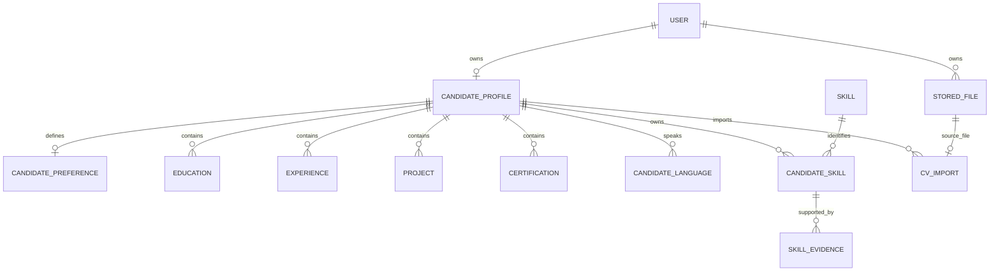
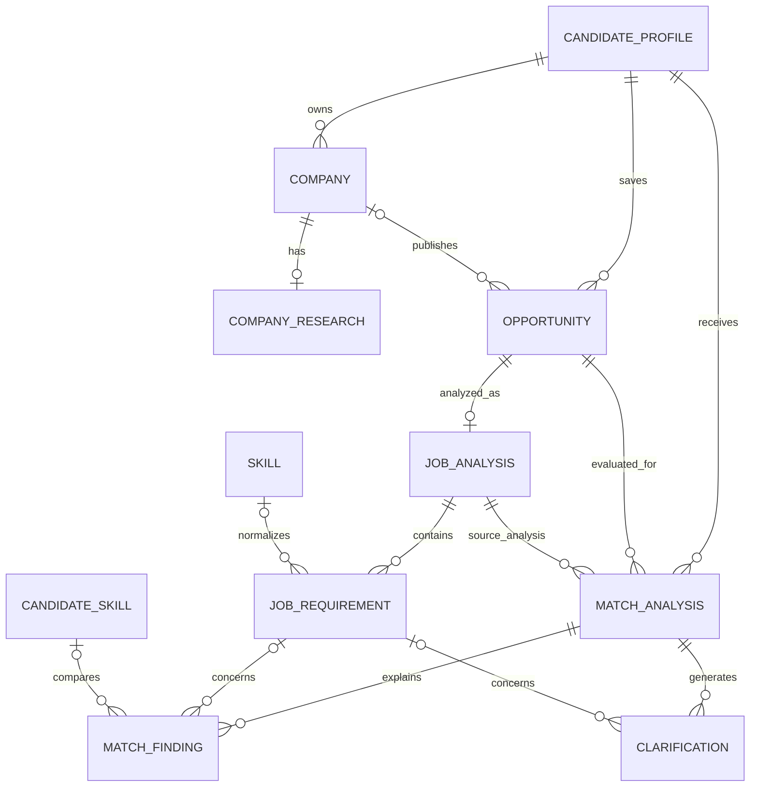
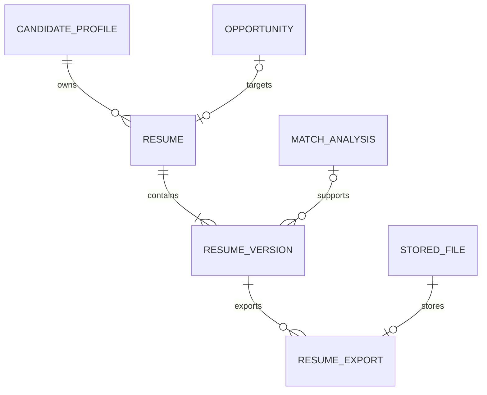
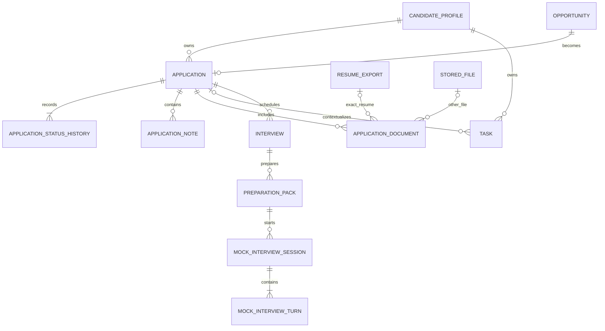
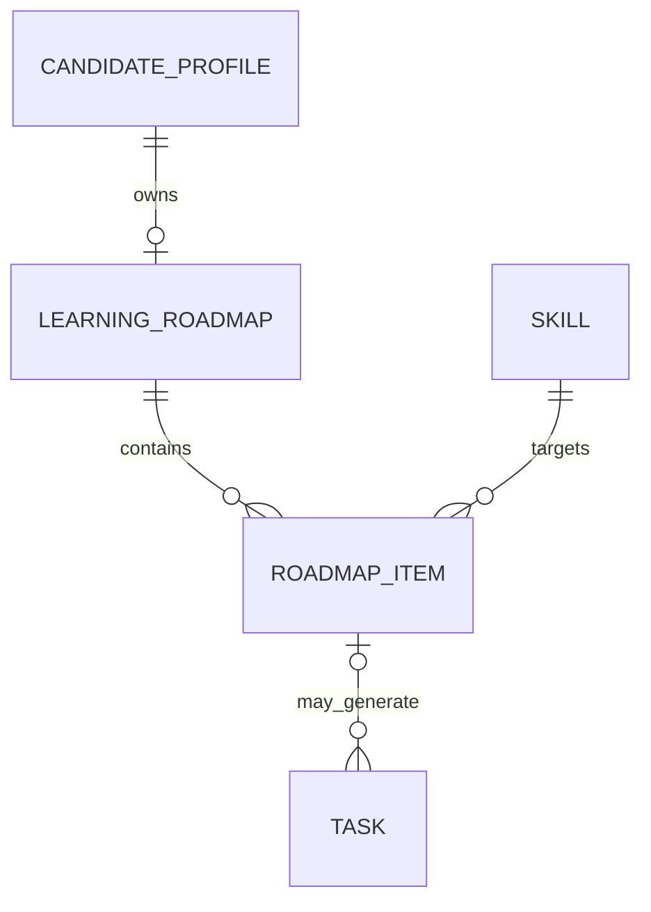
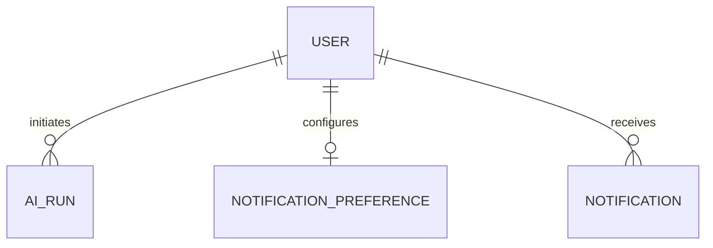

# CareerPilot AI — MCD

## Purpose

This is the approved **Modèle Conceptuel de Données** for the CareerPilot AI MVP.

It defines business entities, conceptual attributes, associations, cardinalities, and invariants. SQL types, FK columns, indexes, and migration syntax are defined in `MLD.md`.

## Cardinalities

- `1,1`: exactly one
- `0,1`: zero or one
- `1,N`: one or many
- `0,N`: zero or many

## Global invariants

1. A user has at most one candidate profile.
2. All candidate-owned data is private to its owner.
3. AI outputs remain proposals until validated.
4. Imported CV data never updates the trusted profile automatically.
5. `claimed` and `verified` are different skill states.
6. An opportunity has one current description and at most one current job analysis.
7. Offer-description versioning is outside the MVP.
8. Every match computation creates a new result with bounded input snapshots.
9. A logical resume can have multiple versions.
10. An approved resume version is immutable.
11. A candidate has at most one application for an opportunity.
12. Every application status transition is preserved.
13. An application document references the exact sent file or resume export.
14. The learning roadmap is current-state only in the MVP.
15. Completing learning work never verifies a skill automatically.

---

# 1. Identity, profile, skills, and CV import

## Entities and conceptual attributes

### USER
Identifier: `user_id`

Attributes: full name, email, password credential, email verification date, role, account status, timezone.

Rules: email is unique; passwords are never stored in plain text; MVP roles are candidate and admin.

### CANDIDATE_PROFILE
Identifier: `profile_id`

Attributes: headline, professional summary, phone, city, country, LinkedIn URL, GitHub URL, portfolio URL, availability status, completion percentage.

Association: USER `(1,1)` owns CANDIDATE_PROFILE `(0,1)`.

### CANDIDATE_PREFERENCE
Identifier: `preference_id`

Attributes: target roles, desired locations, work mode, contract types, salary range, salary currency.

Association: CANDIDATE_PROFILE `(1,1)` defines CANDIDATE_PREFERENCE `(0,1)`.

### EDUCATION
Identifier: `education_id`

Attributes: institution, degree, field of study, start date, end date, description, display order.

Association: CANDIDATE_PROFILE `(1,1)` contains EDUCATION `(0,N)`.

### EXPERIENCE
Identifier: `experience_id`

Attributes: company name, job title, employment type, location, start date, end date, current-position flag, description, display order.

Association: CANDIDATE_PROFILE `(1,1)` contains EXPERIENCE `(0,N)`.

### PROJECT
Identifier: `project_id`

Attributes: title, context, description, repository URL, demo URL, start date, end date, display order.

Association: CANDIDATE_PROFILE `(1,1)` contains PROJECT `(0,N)`.

### CERTIFICATION
Identifier: `certification_id`

Attributes: title, issuer, issue date, expiry date, credential ID, credential URL, display order.

Association: CANDIDATE_PROFILE `(1,1)` contains CERTIFICATION `(0,N)`.

### CANDIDATE_LANGUAGE
Identifier: `candidate_language_id`

Attributes: language, proficiency level.

Association: CANDIDATE_PROFILE `(1,1)` speaks CANDIDATE_LANGUAGE `(0,N)`.

Rule: one language cannot be duplicated within one profile.

### SKILL
Identifier: `skill_id`

Attributes: canonical name, normalized name, category, aliases, active flag.

Rule: normalized name is globally unique.

### CANDIDATE_SKILL
Identifier: `candidate_skill_id`

Attributes: state, proficiency level, years of experience, last-used date.

Associations:
- CANDIDATE_PROFILE `(1,1)` owns CANDIDATE_SKILL `(0,N)`.
- SKILL `(1,1)` identifies CANDIDATE_SKILL `(0,N)`.

Rules: one profile cannot contain the same skill twice; states are `claimed`, `verified`, `learning`, `rejected`, `archived`; AI cannot set `verified`.

### SKILL_EVIDENCE
Identifier: `evidence_id`

Attributes: evidence type, title, description, URL, optional file, optional project, optional experience, optional certification.

Association: CANDIDATE_SKILL `(1,1)` is supported by SKILL_EVIDENCE `(0,N)`.

Rule: at least one meaningful source or manual description must exist.

### STORED_FILE
Identifier: `file_id`

Attributes: original filename, stored filename, disk, storage path, MIME type, extension, size, checksum, visibility, scan status, scan date.

Association: USER `(1,1)` owns STORED_FILE `(0,N)`.

### CV_IMPORT
Identifier: `cv_import_id`

Attributes: processing status, extracted data, reviewed data, sanitized error, processing timestamps, review date, confirmation date.

Associations:
- CANDIDATE_PROFILE `(1,1)` imports CV_IMPORT `(0,N)`.
- STORED_FILE `(1,1)` is the source of CV_IMPORT `(0,1)`.

Rules: extracted data is temporary; only candidate-confirmed items enter the trusted profile.

---

# 2. Companies, opportunities, analysis, and matching

### COMPANY
Identifier: `company_id`

Attributes: name, normalized name, website, industry, location, size band.

Association: CANDIDATE_PROFILE `(1,1)` owns COMPANY `(0,N)`.

Rule: companies are candidate-owned in the MVP.

### COMPANY_RESEARCH
Identifier: `research_id`

Attributes: status, summary, culture, activity, interview tips, sources, sanitized error, researched date.

Association: COMPANY `(1,1)` has COMPANY_RESEARCH `(0,1)`.

Rule: only the current research is retained.

### OPPORTUNITY
Identifier: `opportunity_id`

Attributes: title, source type, source URL, description, location, work mode, contract type, seniority level, salary information, status, saved date.

Associations:
- CANDIDATE_PROFILE `(1,1)` saves OPPORTUNITY `(0,N)`.
- COMPANY `(0,1)` publishes OPPORTUNITY `(0,N)`.

Rule: the description is current state; no offer version table.

### JOB_ANALYSIS
Identifier: `analysis_id`

Attributes: status, summary, confidence, notes, sanitized error, analyzed date.

Association: OPPORTUNITY `(1,1)` is analyzed as JOB_ANALYSIS `(0,1)`.

Rule: reanalysis replaces the current analysis transactionally.

### JOB_REQUIREMENT
Identifier: `requirement_id`

Attributes: type, label, importance, confidence, required flag, structured details, display order.

Associations:
- JOB_ANALYSIS `(1,1)` contains JOB_REQUIREMENT `(0,N)`.
- SKILL `(0,1)` normalizes JOB_REQUIREMENT `(0,N)`.

### MATCH_ANALYSIS
Identifier: `match_analysis_id`

Attributes: status, overall score, scoring version, weights, profile snapshot, job snapshot, calculation date.

Associations:
- CANDIDATE_PROFILE `(1,1)` receives MATCH_ANALYSIS `(0,N)`.
- OPPORTUNITY `(1,1)` is evaluated by MATCH_ANALYSIS `(0,N)`.
- JOB_ANALYSIS `(1,1)` is used by MATCH_ANALYSIS `(0,N)`.

Rules: each recalculation creates a new row; scoring is deterministic backend logic.

### MATCH_FINDING
Identifier: `finding_id`

Attributes: finding type, status, explanation, score contribution.

Associations:
- MATCH_ANALYSIS `(1,1)` explains through MATCH_FINDING `(1,N)`.
- JOB_REQUIREMENT `(0,1)` concerns MATCH_FINDING `(0,N)`.
- CANDIDATE_SKILL `(0,1)` is compared in MATCH_FINDING `(0,N)`.

Statuses: `matched`, `partially_matched`, `missing`, `uncertain`.

### CLARIFICATION
Identifier: `clarification_id`

Attributes: question, answer, status, candidate decision, answered date.

Associations:
- MATCH_ANALYSIS `(1,1)` generates CLARIFICATION `(0,N)`.
- JOB_REQUIREMENT `(0,1)` concerns CLARIFICATION `(0,N)`.

Rule: profile changes require explicit candidate action.

---

# 3. Resumes and exports

### RESUME
Identifier: `resume_id`

Attributes: title, target role, template key, status.

Rules: one logical tailored resume maximum per opportunity; general resumes may have no opportunity.

### RESUME_VERSION
Identifier: `resume_version_id`

Attributes: version number, structured content, status, generated-by source, approval date.

Rules: version number is unique within a resume; approved versions are immutable; factual claims come from trusted data.

### RESUME_EXPORT
Identifier: `resume_export_id`

Attributes: format, status, sanitized error, generated date, expiry date.

Rules: formats are PDF and DOCX; exports are private and authorization-protected.

---

# 4. Applications, tasks, and interviews

### APPLICATION
Identifier: `application_id`

Attributes: current status, applied date, contact name, contact email, contact phone.

Rule: one application maximum per candidate and opportunity.

### APPLICATION_STATUS_HISTORY
Identifier: `status_history_id`

Attributes: previous status, new status, reason, note, actor, changed date.

Rule: immutable; created transactionally with current-status updates.

### APPLICATION_NOTE
Identifier: `note_id`

Attributes: note, creation date.

### APPLICATION_DOCUMENT
Identifier: `application_document_id`

Attributes: document type, label, sent date, exact resume export or exact other file.

Rule: exactly one document source must be present.

### TASK
Identifier: `task_id`

Attributes: title, description, status, priority, due date, reminder date, reminder-sent date, completion date.

Rules: may be general, application-related, or roadmap-related; cannot be linked to both application and roadmap item.

### INTERVIEW
Identifier: `interview_id`

Attributes: stage, schedule, timezone, mode, location, meeting URL, status.

### PREPARATION_PACK
Identifier: `preparation_pack_id`

Attributes: status, summary, likely questions, checklist, context snapshot, sanitized error, generated date.

Rule: context snapshot preserves the job, company research, resume, and stage used.

### MOCK_INTERVIEW_SESSION
Identifier: `mock_session_id`

Attributes: mode, status, start date, completion date.

### MOCK_INTERVIEW_TURN
Identifier: `mock_turn_id`

Attributes: sequence number, question, answer, structured feedback.

Rule: sequence number is unique within a session.

---

# 5. Learning roadmap

### LEARNING_ROADMAP
Identifier: `roadmap_id`

Attributes: status, last calculated date.

Rule: one current roadmap maximum per candidate.

### ROADMAP_ITEM
Identifier: `roadmap_item_id`

Attributes: priority score, demand count, reason, status, progress percentage, target date.

Rules: one skill maximum per roadmap; completion never verifies a skill.

---

# 6. AI audit and notifications

### AI_RUN
Identifier: `ai_run_id`

Attributes: operation type, related subject, provider, model, prompt version, status, tokens, estimated cost, request ID, sanitized error, timestamps.

### NOTIFICATION_PREFERENCE
Identifier: `notification_preference_id`

Attributes: email enabled, app enabled, reminders enabled, interviews enabled, application updates enabled.

### NOTIFICATION
Identifier: `notification_id`

Attributes: type, channel, structured data, status, sent date, read date.

---

# Excluded from the MVP model

- opportunity description versions;
- profile snapshot tables;
- company research versions;
- scoring-rule administration;
- resume-template administration;
- roadmap versions;
- generic EAV models;
- generic async-operation hierarchy;
- multiple reminders per task;
- contact-management tables;
- multiple applications for one candidate and opportunity;
- automatic skill verification by AI.
