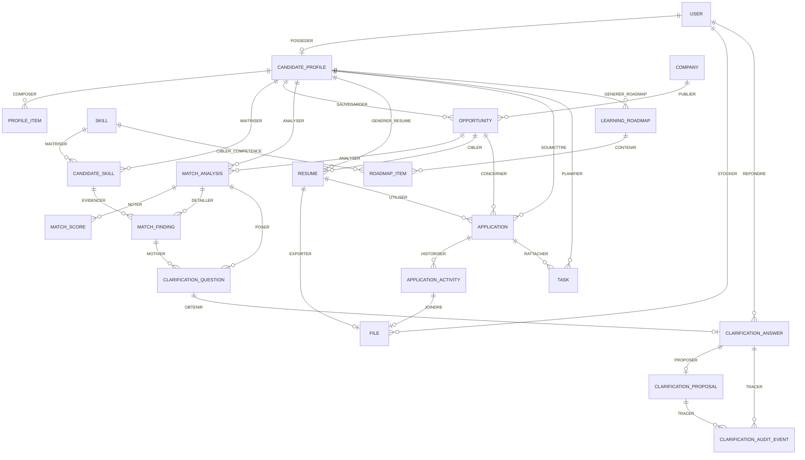

# CareerPilot AI — MCD (Modèle Conceptuel de Données)

## Objectif

Ce document est le **Modèle Conceptuel de Données** officiel pour la version MVP de CareerPilot AI.

Il définit les entités métier, leurs attributs conceptuels, les associations, les cardinalités et les règles de gestion. Les types SQL, les colonnes FK et les index sont définis dans `MLD.md`.

## Conventions

- Noms d'entités en français, au singulier, en majuscules.
- `#` précède l'identifiant conceptuel.
- Les cardinalités : `1,1` (exactement un), `0,1` (zéro ou un), `1,N` (un ou plusieurs), `0,N` (zéro ou plusieurs).
- Les verbes d'association sont à l'infinitif.
- Aucun type SQL, ni PK/FK, ni index dans ce document.

## Carte conceptuelle

```mermaid
erDiagram
    USER ||--o| CANDIDATE_PROFILE : POSSEDER
    CANDIDATE_PROFILE ||--o{ PROFILE_ITEM : COMPOSER
    CANDIDATE_PROFILE ||--o{ CANDIDATE_SKILL : MAITRISER
    SKILL ||--o{ CANDIDATE_SKILL : MAITRISER
    USER ||--o{ FILE : STOCKER
    CANDIDATE_PROFILE ||--o{ OPPORTUNITY : SAUVEGARDER
    COMPANY ||--o{ OPPORTUNITY : PUBLIER
    CANDIDATE_PROFILE ||--o{ MATCH_ANALYSIS : ANALYSER
    OPPORTUNITY ||--o{ MATCH_ANALYSIS : ANALYSER
    MATCH_ANALYSIS ||--o{ MATCH_SCORE : NOTER
    MATCH_ANALYSIS ||--o{ MATCH_FINDING : DETAILLER
    CANDIDATE_SKILL ||--o{ MATCH_FINDING : EVIDENCER
    MATCH_ANALYSIS ||--o{ CLARIFICATION_QUESTION : POSER
    MATCH_FINDING ||--o{ CLARIFICATION_QUESTION : MOTIVER
    USER ||--o{ CLARIFICATION_ANSWER : REPONDRE
    CLARIFICATION_QUESTION ||--o| CLARIFICATION_ANSWER : OBTENIR
    CLARIFICATION_ANSWER ||--o| CLARIFICATION_PROPOSAL : PROPOSER
    CLARIFICATION_ANSWER ||--o{ CLARIFICATION_AUDIT_EVENT : TRACER
    CLARIFICATION_PROPOSAL ||--o{ CLARIFICATION_AUDIT_EVENT : TRACER
    CANDIDATE_PROFILE ||--o{ RESUME : GENERER_RESUME
    OPPORTUNITY ||--o{ RESUME : CIBLER
    RESUME ||--o| FILE : EXPORTER
    CANDIDATE_PROFILE ||--o{ APPLICATION : SOUMETTRE
    OPPORTUNITY ||--o{ APPLICATION : CONCERNER
    RESUME ||--o{ APPLICATION : UTILISER
    APPLICATION ||--o{ APPLICATION_ACTIVITY : HISTORISER
    APPLICATION_ACTIVITY ||--o| FILE : JOINDRE
    CANDIDATE_PROFILE ||--o{ TASK : PLANIFIER
    APPLICATION ||--o{ TASK : RATTACHER
    CANDIDATE_PROFILE ||--o{ LEARNING_ROADMAP : GENERER_ROADMAP
    LEARNING_ROADMAP ||--o{ ROADMAP_ITEM : CONTENIR
    SKILL ||--o{ ROADMAP_ITEM : CIBLER_COMPETENCE
```

---

## 1. Entités et attributs conceptuels

### USER
- **#user_id**
- full_name
- email
- password_hash
- email_verified_at
- role
- account_status
- timezone

**Règles :** L'email est unique. Le mot de passe n'est jamais stocké en clair.

---

### CANDIDATE_PROFILE
- **#profile_id**
- headline
- professional_summary
- phone
- city
- country
- linkedin_url
- github_url
- portfolio_url
- availability_status
- target_roles
- preferred_locations
- work_mode
- contract_types
- salary_min
- salary_max
- languages
- profile_completion

---

### PROFILE_ITEM
- **#item_id**
- type
- title
- organization
- location
- start_date
- end_date
- description
- metadata

**Règles :** Le type peut être `education`, `experience`, `project` ou `certification`.

---

### SKILL
- **#skill_id**
- name
- normalized_name
- category
- is_active

**Règles :** Le nom normalisé est globalement unique.

---

### FILE
- **#file_id**
- original_name
- stored_name
- path
- mime_type
- size
- checksum
- purpose
- processing_status
- extracted_data

**Règles :** `purpose` identifie l'usage métier (ex. `cv_import`, `resume_generated`). Les données extraites sont temporaires ; seules les données validées par le candidat entrent dans le profil de confiance.

> **DEPRECATED as of core-hardening-baseline (2026-08-25):** The generic `FILE` entity is formally deprecated (Option B — purpose-specific entities). No `FILE` table will be created. Purpose-specific tables (`cv_documents`, `application_documents` planned, `resume_exports` via JSON + private storage) replace it. `resumes.file_id` is a dangling column and will be removed in the next `resumes` schema change (Application Documents phase). See `docs/database/README.md` Phase A decisions and `MLD.md` § `files` / § `resumes.file_id` for ownership/provenance and migration details.

---

### COMPANY
- **#company_id**
- name
- website
- industry
- location
- size_band
- research
- researched_at

**Règles :** Les entreprises sont propres à chaque candidat dans le MVP. Une entreprise peut être partagée entre plusieurs offres.

---

### OPPORTUNITY
- **#opportunity_id**
- title
- source_type
- source_url
- description
- location
- work_mode
- contract_type
- seniority_level
- salary_min
- salary_max
- status

**Règles :** La description est l'état courant ; il n'existe pas de versionnage d'offre dans le MVP.

---

### MATCH_ANALYSIS
- **#analysis_id**
- status
- operation_key
- overall_score
- evidence_coverage_score
- required_count
- preferred_count
- matched_count
- partial_count
- gap_count
- unknown_count
- profile_fingerprint
- opportunity_fingerprint
- profile_updated_at
- opportunity_updated_at
- algorithm_version
- scoring_version
- classifier_schema_version
- failure_code
- failure_reason
- request_id
- classifier_provider
- classifier_model
- classifier_prompt_version
- classifier_latency_ms
- classifier_tokens_prompt
- classifier_tokens_completion
- classifier_response_id
- classifier_status
- queued_at
- processing_started_at
- completed_at
- failed_at

**Règles :** Un profil et une offre peuvent avoir plusieurs analyses (snapshots successifs) ; une seule analyse active (`queued`/`processing`) à la fois. L'analyse terminée est immuable ; le recalcul crée un nouveau snapshot. `operation_key` garantit l'idempotence des créations. Les scores déterministes sont calculés par Laravel ; la sortie du classifieur IA ne détermine jamais le score final. Les clarifications utilisent les tables du changement `clarification-workflow`.

---

### MATCH_SCORE
- **#score_id**
- category
- weight
- score
- achieved_points
- total_points
- has_candidate_data

**Règles :** Une ligne par catégorie et par analyse (required_skills, preferred_skills, evidence, experience_education, language_soft). Poids approuvés : 0.500 / 0.200 / 0.150 / 0.100 / 0.050. Une catégorie sans données candidat (`has_candidate_data = false`) n'entre pas dans le score global.

---

### MATCH_FINDING
- **#finding_id**
- source_type
- source_id
- requirement_text
- requirement_label
- importance
- category
- match_state
- factor
- matched_candidate_skill_id
- evidence_refs
- justification
- confidence
- classifier_source
- display_order

**Règles :** Un résultat par exigence (source `job_requirement` ou `job_opportunity_skill`) et par analyse. Facteurs approuvés : verified 1.00, claimed 0.50, learning 0.20, missing 0.00. L'état `unknown` est exclu des points et ne constitue pas une lacune.

---

### CLARIFICATION_QUESTION
- **#question_id**
- match_analysis_id
- match_finding_id
- question_no
- question_type
- prompt
- detail
- template_key
- options_json
- unit
- status
- ai_metadata

**Règles :** Une question est composée depuis un template déterministe versionné (`template_key`) pour chaque résultat incertain à fort impact (`partial`/`gap` avec facteur 0.00/0.50, sans réponse de confiance déjà présente). Au plus trois questions par passe. Une seule réponse par question. L'assistant peut reformuler et ordonner (provenance dans `ai_metadata`) ; le repli déterministe s'applique en cas d'échec du fournisseur.

---

### CLARIFICATION_ANSWER
- **#answer_id**
- user_id
- question_id
- answer_type
- value
- acknowledged_no_evidence
- status
- proposal_id

**Règles :** Une réponse est une saisie candidat avec statut explicite, jamais une donnée de confiance par défaut. `acknowledged_no_evidence` (défaut `false`) reconnaît explicitement l'absence de preuve : avec une réponse `yes`, elle produit `claimed` (0.50), jamais `verified`. La réponse est reliée (0..1) à sa proposition après revue.

---

### CLARIFICATION_PROPOSAL
- **#proposal_id**
- answer_id
- target_type
- target_id
- field
- before_value
- after_value
- status

**Règles :** Une proposition décrit une mutation concrète (entité cible, champ, avant → après) issue d'une réponse d'origine ; une proposition au plus par réponse. Une fois `accepted`, la proposition est immuable et auditable ; seule son acceptation explicite produit une mutation des données de confiance. La cible (`candidate_skill` ou `profile_item`) est polymorphe.

---

### CLARIFICATION_AUDIT_EVENT
- **#event_id**
- answer_id
- proposal_id
- user_id
- match_analysis_id
- target_type
- target_id
- field
- before_value
- after_value
- metadata

**Règles :** Écrit lors de l'acceptation d'une proposition (réponse d'origine, cible, avant/après, métadonnées) de manière best-effort et non bloquante ; les références sont conservées (NULL ON DELETE) pour préserver l'historique.

---

### RESUME
- **#resume_id**
- title
- template_key
- content
- status
- generated_by
- approved_at
- version_no

**Règles :** Un CV peut être générique ou ciblé ; plusieurs versions (`version_no` auto-incrémenté par opportunité) sont autorisées — la contrainte historique « au plus un CV ciblé par opportunité » est levée par `2026_08_24_235959_fix_resumes_unique_for_versioning`. Les versions approuvées sont immuables. La référence historique `FILE` pour l'export est **dépréciée** (Option B — entités purpose-specific) et sera supprimée lors de la prochaine évolution du schéma `resumes` (phase Application Documents) — voir `docs/database/README.md` Phase A decisions et `MLD.md` § `resumes.file_id`.

---

### APPLICATION
- **#application_id**
- current_status
- applied_at
- contact_name
- contact_email
- contact_phone
- next_action_at

**Règles :** Un candidat ne peut soumettre qu'une seule candidature par opportunité.

---

### APPLICATION_ACTIVITY
- **#activity_id**
- type
- old_status
- new_status
- content
- occurred_at

**Règles :** Les activités forment un historique chronologique immuable.

---

### TASK
- **#task_id**
- type
- title
- description
- status
- priority
- scheduled_at
- due_at
- remind_at
- reminder_sent_at
- metadata

**Règles :** Le type peut être `task`, `reminder`, `interview` ou `follow_up`. Une tâche appartient toujours à un candidat et peut optionnellement être liée à une candidature.

> **Phase A recommendation for Phase D (core-hardening-baseline):** Le modèle recommandé est **Option C — entrée `TASK`/`reminder` + enregistrement dédié `interviews`** (lien 1:0..1 de `tasks` vers `interviews`). `interview` comme valeur de `TASK.type` est alors déprécié au profit de la table `interviews` (voir `docs/database/README.md` Phase A decisions et `MLD.md` § `tasks` / future § `interviews`). Aucune table `interviews` n'est créée en Phase A.

---

### LEARNING_ROADMAP
- **#roadmap_id**
- title
- status
- generated_at

**Règles :** Un candidat a au plus un roadmap actif.

---

### ROADMAP_ITEM
- **#roadmap_item_id**
- title
- description
- priority
- status
- progress_percent
- target_date

**Règles :** Un item peut référencer au plus une compétence. Compléter un item ne vérifie pas automatiquement la compétence.

---

## 2. Associations et cardinalités

### POSSEDER
- USER `(0,1)` possède CANDIDATE_PROFILE `(1,1)`
- **Attribut d'association :** date_creation

**Règle :** Un utilisateur a au plus un profil candidat. Un profil appartient toujours à un utilisateur.

---

### STOCKER
- USER `(0,N)` stocke FILE `(1,1)`
- **Attribut d'association :** date_ajout

---

### COMPOSER
- CANDIDATE_PROFILE `(0,N)` compose PROFILE_ITEM `(1,1)`
- **Attribut d'association :** ordre_affichage

---

### MAITRISER
- CANDIDATE_PROFILE `(0,N)` maîtrise SKILL `(0,N)`
- **Attributs d'association :**
  - niveau_competence
  - annees_experience
  - derniere_utilisation
  - preuves

**Règle :** Cette association devient la table `candidate_skills` dans le MLD. Un profil ne peut pas contenir deux fois la même compétence.

---

### SAUVEGARDER
- CANDIDATE_PROFILE `(0,N)` sauvegarde OPPORTUNITY `(1,1)`
- **Attribut d'association :** date_sauvegarde

---

### PUBLIER
- COMPANY `(0,N)` publie OPPORTUNITY `(0,1)`

**Règle :** Une offre peut être publiée par une entreprise ou être sans entreprise identifiée.

---

### ANALYSER
- CANDIDATE_PROFILE `(0,N)` analyse OPPORTUNITY `(0,N)`
- **Attribut d'association :** date_analyse

**Règle :** L'analyse de correspondance devient la table `match_analyses`. Un profil et une opportunité peuvent avoir plusieurs snapshots d'analyse ; une seule analyse active (`queued`/`processing`) à la fois. Les snapshots terminés sont immuables.

---

### NOTER
- MATCH_ANALYSIS `(0,N)` note MATCH_SCORE `(1,1)`

**Règle :** Une ligne de score par catégorie (`match_scores`), calculée de façon déterministe par Laravel.

---

### DETAILLER
- MATCH_ANALYSIS `(0,N)` détaille MATCH_FINDING `(1,1)`

**Règle :** Un résultat par exigence et par analyse (`match_findings`), avec état (`matched`/`partial`/`gap`/`unknown`), facteur et références de preuves.

---

### EVIDENCER
- CANDIDATE_SKILL `(0,N)` évidence MATCH_FINDING `(0,N)`

**Règle :** `matched_candidate_skill_id` relie un résultat à la compétence candidat qui le justifie, sans casser l'historique (NULL ON DELETE).

---

### POSER
- MATCH_ANALYSIS `(0,N)` pose CLARIFICATION_QUESTION `(1,1)`
- **Attribut d'association :** question_no

**Règle :** Une question est rattachée à une analyse (et optionnellement à un résultat via `match_finding_id`). Au plus trois questions par passe ; une seule réponse par question. Les questions sont issues de templates déterministes versionnés ; l'assistant peut reformuler et ordonner avec provenance dans `ai_metadata`.

---

### MOTIVER
- MATCH_FINDING `(0,N)` motive CLARIFICATION_QUESTION `(0,N)`

**Règle :** Une question peut cibler un résultat incertain (`partial`/`gap` avec facteur 0.00/0.50) pour lever l'ambiguïté, sans casser l'historique.

---

### REPONDRE
- USER `(0,N)` répond CLARIFICATION_QUESTION `(1,1)`

**Règle :** Une réponse est une saisie candidat avec statut explicite (`pending`/`accepted`/`rejected`/`skipped`/`expired`), jamais une donnée de confiance par défaut. L'absence de preuve doit être reconnue explicitement (`acknowledged_no_evidence`), sinon la réponse est refusée.

---

### OBTENIR
- CLARIFICATION_QUESTION `(0,1)` obtient CLARIFICATION_ANSWER `(1,1)`

**Règle :** Une question obtient au plus une réponse ; une réponse est liée à une question unique.

---

### PROPOSER
- CLARIFICATION_ANSWER `(0,1)` propose CLARIFICATION_PROPOSAL `(1,1)`
- **Attribut d'association :** avant_apres

**Règle :** Une réponse valide produit une proposition (avant → après) ; une proposition au plus par réponse. Une fois `accepted`, la proposition est immuable et auditable ; seule l'acceptation explicite produit une mutation des données de confiance.

---

### TRACER
- CLARIFICATION_ANSWER `(0,N)` trace CLARIFICATION_AUDIT_EVENT `(0,N)`
- CLARIFICATION_PROPOSAL `(0,N)` trace CLARIFICATION_AUDIT_EVENT `(0,N)`

**Règle :** L'acceptation d'une proposition émet un événement d'audit (réponse d'origine, cible, avant/après, métadonnées) de manière best-effort et non bloquante.

---

### GENERER_RESUME
- CANDIDATE_PROFILE `(0,N)` génère RESUME `(1,1)`
- **Attribut d'association :** date_generation

---

### CIBLER
- OPPORTUNITY `(0,N)` cible RESUME `(0,1)`

**Règle :** Un CV peut cibler une opportunité spécifique ou être générique (sans cible).

---

### EXPORTER
- RESUME `(0,1)` exporte FILE `(0,1)`
- **Attribut d'association :** date_export

---

### SOUMETTRE
- CANDIDATE_PROFILE `(0,N)` soumet APPLICATION `(1,1)`
- **Attribut d'association :** date_creation

---

### CONCERNER
- OPPORTUNITY `(0,1)` concerne APPLICATION `(1,1)`
- **Attribut d'association :** date_candidature

**Règle :** Une candidature concerne exactement une opportunité. Un candidat ne peut postuler qu'une seule fois à la même opportunité.

---

### UTILISER
- RESUME `(0,N)` utilise APPLICATION `(0,1)`
- **Attribut d'association :** date_utilisation

---

### HISTORISER
- APPLICATION `(0,N)` historise APPLICATION_ACTIVITY `(1,1)`
- **Attribut d'association :** date_action

**Règle :** Les activités sont immuables et enregistrées chronologiquement.

---

### JOINDRE
- APPLICATION_ACTIVITY `(0,1)` joint FILE `(0,1)`
- **Attribut d'association :** date_ajout

---

### PLANIFIER
- CANDIDATE_PROFILE `(0,N)` planifie TASK `(1,1)`
- **Attribut d'association :** date_creation

---

### RATTACHER
- APPLICATION `(0,N)` rattache TASK `(0,1)`

---

### GENERER_ROADMAP
- CANDIDATE_PROFILE `(0,N)` génère LEARNING_ROADMAP `(1,1)`
- **Attribut d'association :** date_generation

---

### CONTENIR
- LEARNING_ROADMAP `(1,N)` contient ROADMAP_ITEM `(1,1)`
- **Attribut d'association :** ordre_affichage

---

### CIBLER_COMPETENCE
- SKILL `(0,N)` cible ROADMAP_ITEM `(0,1)`

---

## 3. Règles de gestion

1. Un utilisateur a au plus un profil candidat.
2. Un profil candidat appartient toujours à un utilisateur.
3. Un élément de profil (PROFILE_ITEM) représente un diplôme, une expérience, un projet ou une certification.
4. Une compétence (SKILL) peut être partagée par plusieurs profils candidats.
5. L'association MAITRISER porte le niveau de compétence, l'expérience, la dernière utilisation et les preuves.
6. Chaque offre (OPPORTUNITY) appartient à un profil candidat.
7. Un profil et une opportunité peuvent avoir plusieurs analyses de correspondance (snapshots) ; une seule analyse active (`queued`/`processing`) à la fois.
8. Une analyse de correspondance stocke des instantanés (snapshots) pour préserver la cohérence historique et détecter la péremption (staleness) par empreintes.
9. Un candidat ne peut soumettre qu'une seule candidature pour la même offre.
10. Un CV peut être générique ou ciblé vers une opportunité.
11. Les activités de candidature forment un historique chronologique immuable.
12. Une tâche appartient toujours à un candidat et peut optionnellement être liée à une candidature.
13. Un roadmap contient un ou plusieurs éléments (ROADMAP_ITEM).
14. Un élément de roadmap peut optionnellement référencer une compétence.
15. Les fichiers (FILE) sont une infrastructure partagée ; le champ `purpose` identifie leur usage métier.

---

## 4. Tables écartées du modèle MVP

- Versions d'offre (opportunity description versions)
- Préférences candidates (candidate_preferences) — fusionné dans CANDIDATE_PROFILE
- Langues (candidate_languages) — fusionné dans CANDIDATE_PROFILE
- Éducation, Expérience, Projet, Certification (entités séparées) — fusionnés dans PROFILE_ITEM
- Preuves de compétence (skill_evidences) — fusionné dans MAITRISER
- Import CV (cv_imports) — remplacé par FILE avec purpose `cv_import`
- Recherche entreprise (company_research) — fusionné dans COMPANY
- Analyse d'offre détaillée (job_analyses, job_requirements) — tables séparées, changement job-analysis
- Analyse de correspondance (match_analyses, match_findings) — tables normalisées `match_analyses`, `match_scores`, `match_findings`, changement profile-job-matching
- Clarifications (clarifications) — tables `clarification_questions`, `clarification_answers`, `clarification_proposals`, `clarification_audit_events`, changement clarification-workflow
- Versions de CV (resume_versions) — fusionné dans RESUME via content JSON
- Export CV (resume_exports) — fusionné via RESUME → FILE
- Historique statut (application_status_histories) — fusionné dans APPLICATION_ACTIVITY
- Notes (application_notes) — fusionné dans APPLICATION_ACTIVITY
- Documents (application_documents) — fusionné dans APPLICATION_ACTIVITY
- Entretiens (interviews) — fusionné dans TASK via type `interview`
- Kits de préparation, simulations d'entretien, échanges — reportés
- Notifications et préférences de notification — reportées
